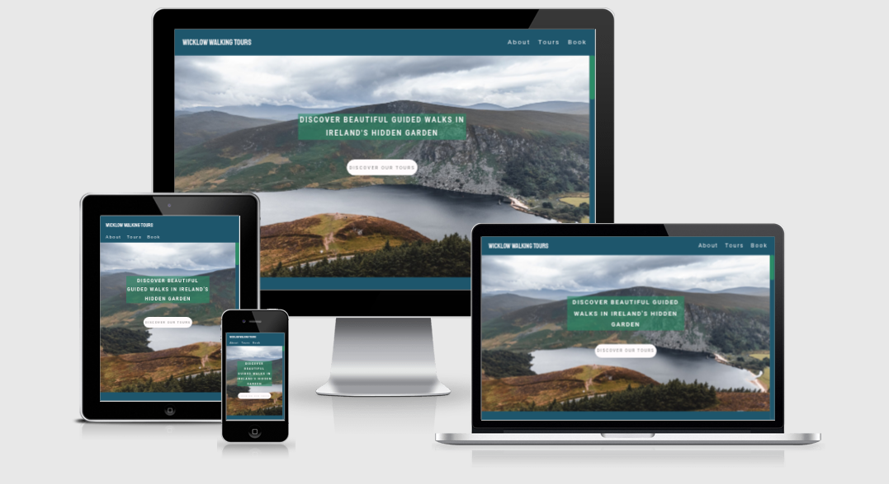
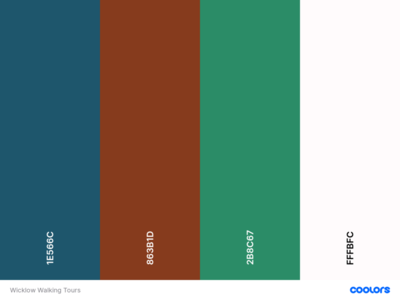
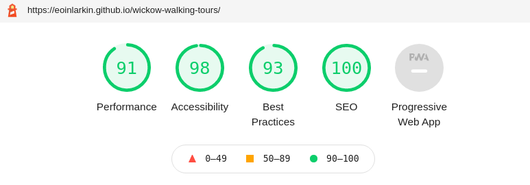

# Wicklow Walking Tours

- [Wicklow Walking Tours](#wicklow-walking-tours)
  * [Objective](#objective)
    + [User Stories](#user-stories)
  * [Design and Layout](#design-and-layout)
    + [Content](#content)
    + [Site Layout](#site-layout)
  * [User Experience](#user-experience)
    + [Color Scheme](#color-scheme)
  * [Testing](#testing)
    + [Validator Testing](#validator-testing)
    + [Device Testing](#device-testing)
    + [Performance Testing](#performance-testing)
    + [Bugs](#bugs)
    + [Known Bugs](#known-bugs)
  * [Development](#development)
    + [Languages](#languages)
    + [Tools / Technologies](#tools---technologies)
  * [Credits](#credits)
    + [GPX Routes](#gpx-routes)
    + [Media](#media)
    + [Code Attribution](#code-attribution)
    + [Other](#other)

## Objective 

The project aimed to achieve the following objectives:

- Build a user friendly static website with a high level of compliance with modern modern CSS and HTML design principles 
- The website would be fully responsive and work across both desktop, mobile and table devices
- The desktop would incorporate a range of design features that would deliver an engaging and delightful experience for the end user

### User Stories

- **As a potential customer**
    - I want to be able to discover what types of walking tours are offered.
    - The information on the site should be clearly presented and easy to understand.
    - I want to be able to access the website from both mobile and desktop devices.  
    - I want to be able to preview the site route.

- **As the site owner**
    - I want to allow potential customers find out more about the different types of walking tours offered.
    - I want to provide users with the ability to send a tour booking enquiry.
    - I want to provide users with contact information for the company.

- - - 

## Design and Layout

### Content
The content of the site was inspired by personal experience hiking in the Wicklow Mountains as well as my experience using websites to plan and map hiking routes.

### Site Layout

The site layout was drawn out by hand; core elements were as follows:

- A static navbar that would persist on scroll.
- A Hero Image with a fade in element.
- Site content would be laid out in a gird format with a gird size of two columns. This would collapse to one column for responsive devices.
- In order to offer a more immersive user experience a themed scroll bar would be used.

## User Experience

In designing the user experience, I aimed to satisfy the user stories defined by both the site owner and the site user

- A fade in animation would 'reveal' the hero image to the user
- The site would utilise maps to illustrate the walking routes that were offered
- A contact form would be used for customers to contact the company for walking tours
- The site would allow the user to preview the walking trails. This would be achieved using a dynamic GPX track being overlaid on a Google Map using the Google maps API

### Color Scheme

The color palette for the site was inspired by the hero image; colors were selected to suggest earth, water and grass elements. 

The colors chosen were as follows :
- #1E566C Blue Sapphire
- #863B1D Kobe
- #2B8C67 Sea Green
- #FFFBFC Snow

- - - 

## Testing 

### Validator Testing 

- HTML
  - No errors were returned when passing through the official [W3C validator](https://validator.w3.org/nu/?doc=https%3A%2F%2Feoinlarkin.github.io%2Fwickow-walking-tours%2F)
  - Three warnings were reported; these related to suggestions to add `h2-h6` header elements to the site sections; however these warnings are only advisory. 
- CSS
  - No errors were found when passing through the official [Jigsaw validator](http://jigsaw.w3.org/css-validator/validator?uri=https%3A%2F%2Feoinlarkin.github.io%2Fwickow-walking-tours%2F&profile=css3svg&usermedium=all&warning=1&vextwarning=)
  
### Device Testing

Testing was completed across a number of platforms as follows:

- The site was tested on Chrome and Firefox
- Testing was completed on Linux, Windows and iOS
- The device was tested across a number of screen sizes, from a simulated Galaxy Fold to a 4k display

### Performance Testing

Performance was tested using Lighthouse in Chrome Dev Tools. The final full reports can be found here: 

- Performance issues on Desktop were highlighted with respect to the site load times. This was driven by very large image sizes and was mostly resolved by the resizing and compressing of images.
- Performance issues on Mobile were also highlighted with respect to the site load times. In this instance, this was being driven by the importing of the images from the Google Maps API. As I was unable to resize these images, give the content was dynamic I chose to accept these performance issues. Preview of the routes was a core website feature and I did not want to compromise this over performance.

### Bugs

The following bugs were encountered during the development and the following fixes were implemented:

- - -
**Bug:** GPX route overlay did not initially work when the site was published on GitHub pages. The site had been tested locally using relative paths to the underlying GPX files but these were not being read when hosted on GitHub Pages.

**Fix:** This was fixed by linking directly to the raw gpx files being hosted on GitHub as opposed to using relative paths from the javascript file. 
- - -

- - -
**Bug:** Laggy scrolling was encountered when scrolling on both desktop and mobile. 

**Fix:** This bug was being caused by very large image sizes. The original image sizes were a combined total of over 10MB. This was reduced to under 600Kb following image resizing.  
- - -

- - -
**Bug:** Persistent navbar was initially overlapping the scroll bar.

**Fix:** This was a design bug and was fixed by wrapping the site content in a separate container.
- - -

- - -
**Bug:** Responsive flexbox elements were not dynamically resizing as expected with overflow of elements.

**Fix:** This was an annoying bug to fix; it was being caused by the fixed width of the site elements. Finally it was fixed by setting heights and widths equal to min and max values that were defined in terms of responsive units.
- - -

### Known Bugs

Following testing, the following known bugs were found and remain unresolved:

- **Text jump on initial load:**  
On loading the site for the first time the Hero Text element will 'jump'. I suspect this is due to the way the Hero Text element has been placed using a gird overlay on the hero image and is related to the viewport recalculating after the initial load.    
I was unable to resolve the bug prior to deployment but overall it is relatively minor and does not compromise the site integrity.

- - - 

## Development

### Languages
- HTML
- CSS
- Javascript

### Tools / Technologies

- **[VScode](https://code.visualstudio.com/)**  
All coding was completed in VS Code with a number of extensions used.

- **[Google Maps API](https://developers.google.com/maps)**  
This was used to generate the location marker for the business address as well as being used to generate the dynamic maps with the overlaid gpx files

- **[coolors.co](https://coolors.co/)**  
Potential site palettes were tested with Coolors.  

- **[gauger.io](https://gauger.io/fonticon/)**  
This website was used to generate the favicon using an icon from Font Awesome.

- **[ImageMagick](https://imagemagick.org/index.php)**  
For resizing images for the improvement of site performance

- **[Am I Responsive?](http://ami.responsivedesign.is/)**  
For rendering the device preview image

- **[https://ecotrust-canada.github.io/](https://ecotrust-canada.github.io/markdown-toc/)**  
For generating the markdown table of contents

- - - 

## Credits 

### GPX Routes

  - [leondolman](https://www.wikiloc.com/hiking-trails/djouce-mountain-ireland-402513)
  - [macbre.pl](https://www.wikiloc.com/hiking-trails/glendalough-spinc-walk-79193412)
  - [Paul Martin Kelly](https://www.wikiloc.com/walking-trails/powerscourt-garden-walk-67639081)  

### Media

- Images were sourced from [Unsplash](https://unsplash.com/). In particular:  

  - About Image: [Cole Patrick](https://unsplash.com/photos/LttKJcNHzUc?utm_source=unsplash&utm_medium=referral&utm_content=creditShareLink)

  - Hero Image: [Margaux Bébin](https://unsplash.com/photos/6YZ2w5NRIAg?utm_source=unsplash&utm_medium=referral&utm_content=creditShareLink)

### Code Attribution

- The code for the persistent navbar was inspired by the following post on W3 Schools: [link](https://www.w3schools.com/howto/howto_css_fixed_menu.asp)

- A fix for the navbar overlapping the hero image was taken from the following Stackoverflow post: [link](https://stackoverflow.com/questions/49133277/why-is-this-hero-image-covering-the-fixed-nav-bar-with-the-nav-bar-reappearing)

- The following code was referenced to create the color transition: [link](https://stackoverflow.com/questions/11679567/using-css-for-a-fade-in-effect-on-page-load)

- The following code was referenced for the star icons: [link](https://stackoverflow.com/questions/49343074/css-for-star-ratings-via-fontawesome)

- The following code was referenced for the creation of the gird layout: [link](https://gridbyexample.com/examples/example2/)

- Google Maps GPX overlay was inspired by the following post from Stackoverflow: [link](https://stackoverflow.com/questions/15829048/best-way-to-import-coordinates-from-gpx-file-and-display-using-google-maps-api)

- In order to get more than one Google Map embed working, the following post was referenced: [link](https://stackoverflow.com/questions/46631141/two-google-maps-on-same-page-with-markers)

- Images converted with Image Magik using the following recommended settings: [link](https://stackoverflow.com/questions/7261855/recommendation-for-compressing-jpg-files-with-imagemagick)

### Other

- CodeInstitute modules on HTML, CSS and UX.
- My mentor for his suggestions and feedback on the project.
- Jonas Schmedtmann advanced CSS course on Udemy
